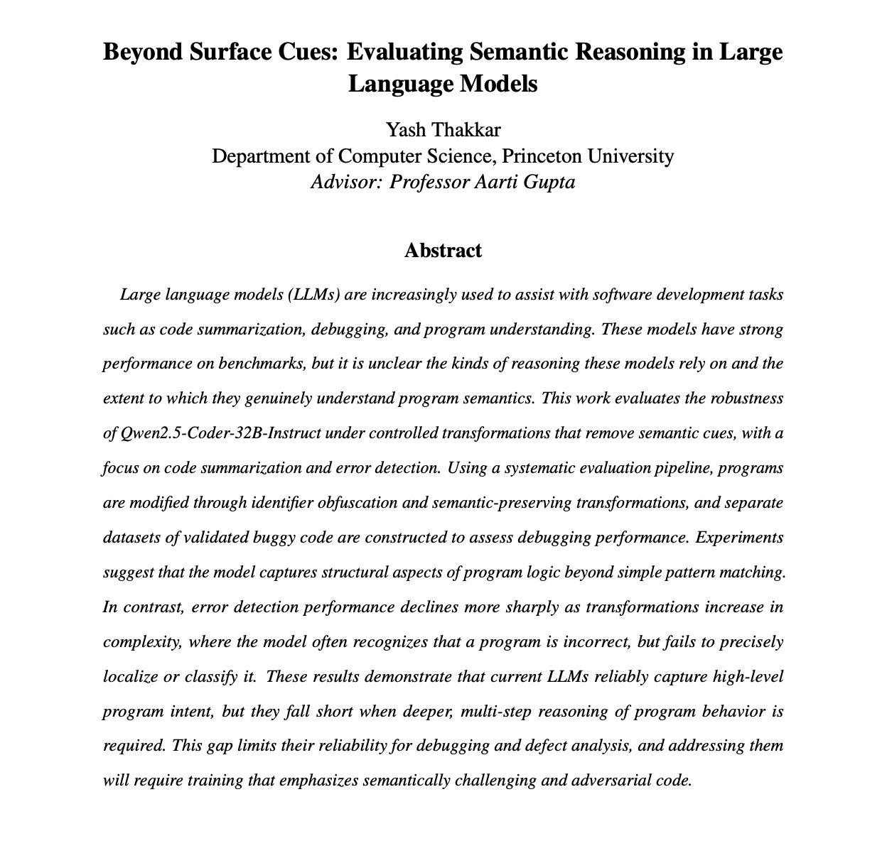

# Beyond Surface Cues: Evaluating Semantic Reasoning in Large Language Models

Large language models (LLMs) are increasingly used for software development tasks like code summarization, debugging, and program understanding. While these models show strong benchmark performance, it remains unclear whether they genuinely understand program semantics or merely rely on surface-level cues like variable names and code patterns. This project directly evaluates the robustness of **Qwen2.5-Coder-32B-Instruct** by testing its ability to understand code semantics when such cues are removed through identifier obfuscation and by assessing its error detection capabilities on validated buggy code. The findings reveal that while the model captures high-level program intent effectively, it struggles with deeper, multi-step reasoning required for precise error localization and classification, highlighting important limitations for real-world debugging applications.

## Overview

Two evaluation pipelines:

1. **Code Obfuscation Understanding** - Can a model infer problem descriptions from code with intentionally confusing variable names?
2. **Error Detection** - Can a model identify, locate, and analyze bugs in incorrect code?

Both pipelines follow three stages:
- **Stage 1**: Generate test cases using Claude
- **Stage 2**: Evaluate Qwen's performance
- **Stage 3**: Use ChatGPT as an LLM-as-a-Judge to evaluate Qwen's responses

## 📄 Full Report

[](written_report.pdf)

*Click the preview to open the full PDF.*

## Repository Structure

```
├── code_obfuscation/          # Code obfuscation evaluation
│   ├── generate_code_obfuscation.py          # Stage 1: Obfuscate code
│   ├── qwen_mppb_pro_evaulation.py           # Stage 2: Query Qwen
│   ├── llm_judge_evaluation.py               # Stage 3: Judge evaluation
│   └── generate_summary.py                   # Generate statistics
│
├── error_detection/            # Error detection evaluation
│   ├── 1_generate_incorrect_code.py          # Stage 1: Generate bugs
│   ├── 2_qwen_analyze_incorrect_code.py      # Stage 2: Qwen analysis
│   ├── 3_llm_judge_error_detection.py        # Stage 3: Judge evaluation
│   └── generate_summary_from_evaluations.py  # Generate statistics
│
├── mbpp_pro/                   # MBPP-Pro dataset (378 files)
├── codeeval_pro_data.py        # Dataset download utility
├── qwen_api.py                 # Qwen API wrapper
└── requirements.txt            # Python dependencies
```

## Quick Start

### Prerequisites

1. Install dependencies:
   ```bash
   pip install -r requirements.txt
   ```

2. Set environment variables:
   ```bash
   export ANTHROPIC_API_KEY="your-anthropic-api-key"
   export HF_ENDPOINT_URL="https://your-hf-endpoint.com/v1/chat/completions"
   export HF_TOKEN="your-huggingface-token"
   export OPENAI_API_KEY="your-openai-api-key"
   ```

3. Download dataset:
   ```bash
   python codeeval_pro_data.py
   ```

### Running Pipelines

#### Code Obfuscation

```bash
cd code_obfuscation
python generate_code_obfuscation.py --input-dir ../mbpp_pro --output-dir mbpp_pro_code_obfuscation
python qwen_mppb_pro_evaulation.py
python llm_judge_evaluation.py --ground-truth-dir ../mbpp_pro --qwen-response-dir qwen_code_obfuscation_description_response --obfuscated-code-dir mbpp_pro_code_obfuscation --output-dir llm_judge_evaluations
```

#### Error Detection

```bash
cd error_detection
python 1_generate_incorrect_code.py --seed 42 --skip-existing
python 2_qwen_analyze_incorrect_code.py --skip-existing
python 3_llm_judge_error_detection.py --skip-existing
```

## Models Used

- **Claude Sonnet 4.5**: Generates obfuscated code and incorrect code variants
- **Qwen2.5-Coder-32B-Instruct**: Model being evaluated
- **ChatGPT 5.1**: LLM-as-a-Judge for evaluation

## Results

### Code Obfuscation Understanding
- 379 evaluations
- Metrics: Semantic accuracy, completeness, transformation understanding, robustness

### Error Detection
- 374 evaluations
- Overall: 2.83/5.0
- Best: Error Location Precision (3.46/5.0)
- Weakest: Completeness (2.22/5.0)

## Dependencies

See `requirements.txt` for full list. Core packages:
- `huggingface_hub`, `python-dotenv`, `requests`, `openai`, `anthropic`

For detailed pipeline documentation:
- [`code_obfuscation/README.md`](code_obfuscation/README.md)
- [`error_detection/README.md`](error_detection/README.md)

## Acknowledgments

This project used generative AI tools for code generation and brainstorming during development, but all written content was authored independently.
